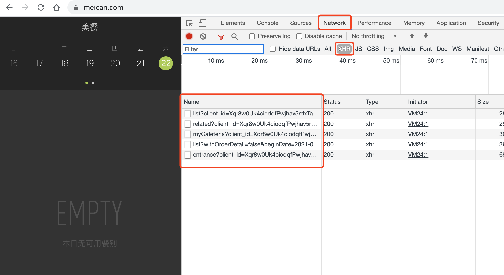
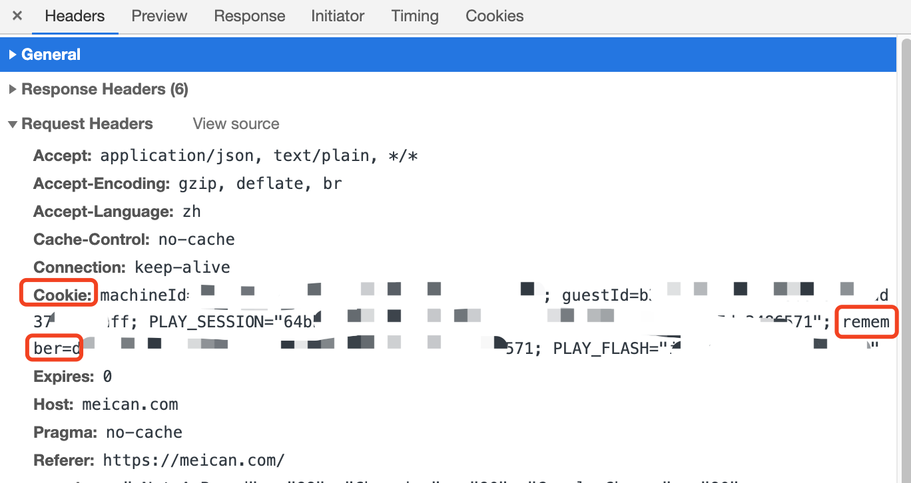

# gomeican

meican sdk by Go.

## 使用说明


```go
    // token 获取的方式参见下面
    meian := NewMeican(token)

    // 获取今天可以预定的餐
    orders, err := meican.GetTodayOrderList(context.Background())

    // 或者
    // 获取指定日期的可预定的餐
    d := time.Date(2021, time.Month(5), 25, 0, 0, 0, 0, time.Local)
    orders, err := meican.GetOrderList(context.Background(), d)
```


## token的获取方式

1. 使用`Chrome浏览器`打开[meican.com](https://meican.com/)，登录。

2. 右键 - 检查


3. 点击任意一个，获取请求头部的Cookie信息。

只需要其中`remember`对应的值。